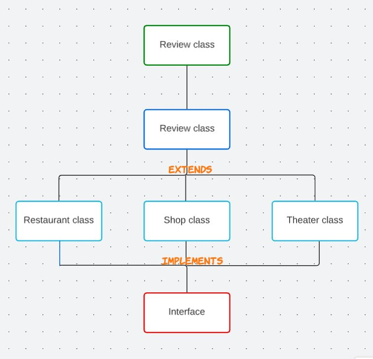

# java-fundamentals

contains labs assignment's work during 401 course in Java

# Lab02

methods:

- roll : accepts an integer n and rolls a six-sided dice n times. The method returns an array containing the values of the rolls.

- containsDuplicates : returns true or false depending on whether the array contains duplicate values.

- average : given an array of arrays calculates the average value for each array and return the array with the lowest average.

# Lab03

methods :

- getTemp : will take and array of arrays of temperature readings and will return the lowest and highest temperature and the missing temperature values between them.

- tally : will count the votes and prints out the name of the winner.

- ReadFile : will take file path as input and will parse it and return the number of lines which doesn't include semicolon, if keyword, else keyword, curly braces .

# Lab 06 & 07

methods:

- addReview : adds a new review to the facility by adding name of writer, body of the review, and rating. then it apdates the overall rating for the facility.

- toStringMethod : Put author's name, rating input, and review's body in a readable form.

